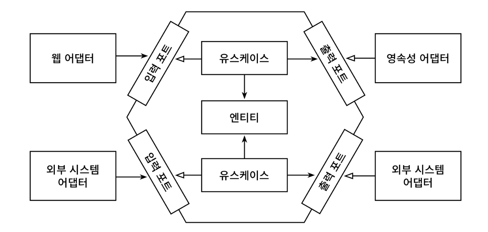
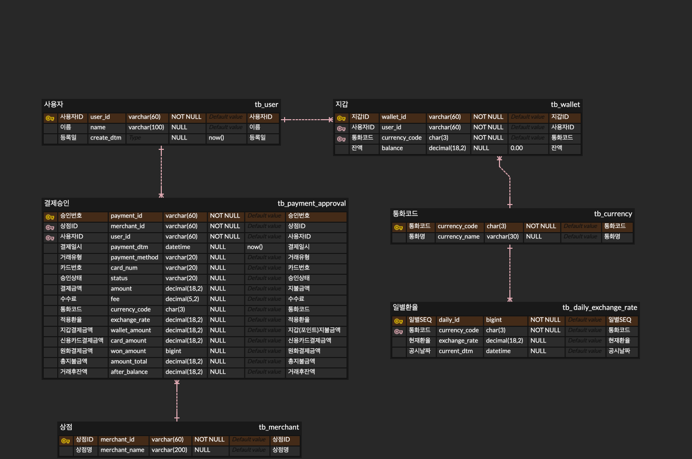

# Simple Payment Service

포인트를 이용한 간단한 결제 승인 시스템

## 디렉토리 구조
---
핵사고날 아키텍처의 Port And Adapter 패턴을 이용하여 구성



디렉토리

```tree
└── payment
    ├── SimplePaymentServerApplication.java
    ├── adapter
    │   ├── in
    │   │   └── web
    │   └── out
    │       └── persistence
    │           ├── exchangerate
    │           ├── merchant
    │           ├── payment
    │           └── user
    ├── application
    │   └── port
    │       ├── in
    │       └── out
    ├── config
    ├── domain
    │   ├── exchangerate
    │   ├── merchant
    │   ├── payment
    │   └── user
    └── exception
```

* adapter
    * in : [외부에서 들어온 요청 처리 adapter]
        * web : 잔액조회, 결제 예상결과, 결제승인요청에 대한 Controller
    * out : [외부로 모듈과 통신 및 연결 adapter]
        * persistence
            * exchangerate : 환율 Entity, Repository
            * merchant : 상점 Entity, Repository
            * payment : 결제 Entity, Repository
            * user : 사용자 Entity, Repository
    * application [비지니스 로직 어플리케이션]
        * port : [어플리케이션 계층의 인커밍 포트를 호출하여 내부접근하는 인터페이스와 아웃고잉 포트에 대한 구현을 아웃고잉 어댑터를 가지고 있는 인터페이스]
          * in : adpater.in에서 내부 비지니스 서비스를 연결 해주는 인터페이스
          * out : 비지니스 처리 시 외부 adapter.out을 연결 해주는 인터페이스
* application
    * service : 비지니스 서비스 처리 구현부
* domain : [도메인 모델 구성]
    * exchangerate : 환율관련 도메인
    * merchant : 상점 도메인
    * payment : 결제 도메인
    * user : 사용자 도메인


## 테이블 명세서
---


### tb_user - 사용자 테이블

|      COLUMN      |     TYPE     | KEY |  NULL?   |              Default              | COMMENT |
|:----------------:|:------------:|:---:|:--------:|:---------------------------------:|:-------:|
|     user_id      | varchar(60)  | PK  | NOT NULL |                                   |  사용자ID  |
|       name       | varchar(100) |     |   NULL   |                                   |   이름    |
|    create_dtm    |   datetime   |     |   NULL   |         current_timestamp         |   등록일   |

### tb_wallet - 지갑 테이블

|    COLUMN     |     TYPE      | KEY |  NULL?   | Default | COMMENT |
|:-------------:|:-------------:|:---:|:--------:|:-------:|:-------:|
|   wallet_id   |    bigint     | PK  | NOT NULL |         |  지갑ID   |
|    user_id    |  varchar(60)  | FK  | NOT NULL |         |  사용자ID  |
| currency_code |    char(3)    | FK  | NOT NULL |         |  통화코드   |
|    balance    | decimal(18,2) |     |   NULL   |  0.00   |   잔액    |

### tb_currency - 통화 테이블

|    COLUMN     |    TYPE     | KEY |  NULL?   |      Default      | COMMENT |
|:-------------:|:-----------:|:---:|:--------:|:-----------------:|:-------:|
| currency_code |   char(3)   | PK  | NOT NULL |                   |  통화코드   |
| currency_name | varchar(30) |     |   NULL   |                   |   통화명   |


### tb_daily_exchange_rate - 일별환율 테이블

|    COLUMN     |     TYPE      | KEY |  NULL?   | Default | COMMENT |
|:-------------:|:-------------:|:---:|:--------:|:-------:|:-------:|
|   daily_id    |    bigint     | PK  | NOT NULL |         |  일별SEQ  |
| currency_code |    char(3)    | FK  | NOT NULL |         |  통화코드   |
| exchange_rate | decimal(18,2) |     |   NULL   |         |  현재환율   |
|  current_dtm  |   datetime    |     |   NULL   |         |  공시날짜   |


### tb_payment_approval - 결제승인 테이블

|     COLUMN     |     TYPE      | KEY |  NULL?   |      Default      |           COMMENT            |
|:--------------:|:-------------:|:---:|:--------:|:-----------------:|:----------------------------:|
|   payment_id   |  varchar(60)  | PK  | NOT NULL |                   |             승인번호             |
|  merchant_id   |  varchar(60)  |     | NOT NULL |                   |             상점ID             |
|    user_id     |  varchar(60)  |     | NOT NULL |                   |            사용자ID             |
|  payment_dtm   |   datetime    |     |   NULL   | current_timestamp |             결제일시             |
| payment_method |  varchar(20)  |     |   NULL   |                   |    거래유형(creditCard,point)    |
|    card_num    |  varchar(20)  |     |   NULL   |                   |             카드번호             |
|     status     |  varchar(20)  |     |   NULL   |                   | 승인상태request,approved,failed) |
|     amount     | decimal(18,2) |     |   NULL   |                   |             지불금액             |
|      fee       | decimal(5,2)  |     |   NULL   |                   |             수수료              |
| currency_code  |    char(3)    |     |   NULL   |                   |             통화코드             |
| exchange_rate  | decimal(18,2) |     |   NULL   |                   |             적용환율             |
| wallet_amount  | decimal(18,2) |     |   NULL   |                   |         지갑(포인트)지불금액          |
|  card_amount   | decimal(18,2) |     |   NULL   |                   |          신용카드 결제금액           |
|   won_amount   |    bigint     |     |   NULL   |                   |             원화금액             |
|  amount_total  | decimal(18,2) |     |   NULL   |                   |            총지불금액             |
| after_balance  | decimal(18,2) |     |   NULL   |                   |            거래후잔액             |


### tb_merchant - 상점 테이블

|    COLUMN     |     TYPE     | KEY |  NULL?   | Default | COMMENT |
|:-------------:|:------------:|:---:|:--------:|:-------:|:-------:|
|  merchant_id  | varchar(60)  | PK  | NOT NULL |         |  상점ID   |
| merchant_name | varchar(200) |     |   NULL   |         |   상점명   |


## API 명세서
---

### 통신방법

- Protocol : HTTP
- Data Format: JSON
- Encoding : UTF-8
- Port : 8080

**테스트 계정**
사용자 ID : user1234
상점 ID : merchantId1234

### Swagger

- 프로젝트 실행 후 아래 링크를 통해 API 명세를 확인할 수 있다.
> http://localhost:8080/api-docs


### 1. Error Response Data Format

#### 1-1. Error Response 공통 데이터 포멧

| Parameter | Description |  
|:---------:|:------------|
|   code    | 서비스 코드      |
|  message  | 메시지         |
|   data    | 오류 데이터      |


#### 1-2. Error data 필드
| Parameter | Description |  
|:---------:|:------------|
|   field   | 파라미터        |
|   value   | 요청 값        |
|  reason   | 메시지         |


#### 1-4. Example

- Http Status 400 Bad Request
```json
{
  "code": "4000",
  "message": "공백일 수 없습니다",
  "data": [
    {
      "field": "userId",
      "value": "",
      "reason": "공백일 수 없습니다"
    }
  ]
}
```


### 2. API

#### 2-1. 잔액조회

현재 보유하고 있는 지갑의 잔액을 조회

- URI : /api/payment/balance/{userId}
- Method : GET

* curl

```curl
curl -X 'GET' \
  'http://localhost:8080/api/payment/balance/user1234' \
  -H 'accept: */*'
```

**[Response]**

| Parameter | Description |
|:---------:|:------------|
|  userId   | 사용자ID       |
|  balance  | 잔액          |
| currency  | 통화코드        |


```json
[
  {
    "userId": "user1234",
    "balance": 1000.25,
    "currency": "USD"
  },
  {
    "userId": "user1234",
    "balance": 10000,
    "currency": "KRW"
  }
]
```


#### 2-2. 결제 예샹 결과 조회

결제금액에 대한 예상 결제 가격 및 결제 수수료 조회

- URI : /api/payment/estimate
- Method : POST


**[Request]**

|   Parameter    | Require | Description |  
|:--------------:|:-------:|:------------|
|     amount     |    Y    | 결제금액        |
|    currency    |    Y    | 통화코드        |
|   merchantId   |    Y    | 상점ID        |
|     userId     |    Y    | 사용자ID       |


```json
{
  "amount": 150.00,
  "currency": "USD",
  "merchantId": "merchantId1234",
  "userId": "user1234"
}
```

* curl

```curl
curl -X 'POST' \
  'http://localhost:8080/api/payment/estimate' \
  -H 'accept: */*' \
  -H 'Content-Type: application/json' \
  -d '{
  "amount": 150.00,
  "currency": "USD",
  "merchantId": "merchantId1234",
  "userId": "user1234"
}'
```

**[Response]**

|   Parameter    | Description |
|:--------------:|:------------|
| estimatedTotal | 예상결제금액      |
|      fees      | 수수료         |
|    currency    | 통화코드        |


```json
{
  "estimatedTotal": 154.5,
  "fees": 4.5,
  "currency": "USD"
}
```


#### 2-3. 결제 승인 요청

최종 결제 승인 요청 처리
paymentMethod type에 따른 결제 처리
creditCard : 지갑 잔액이 충분할 경우 포인트로 결제하고, 지갑 잔액이 부족할 경우 차액만큼 신용카드로 결제
point : 지갑잔액이 충분할 경우 포인트로 결제하고, 지갑 잔액이 부족할 경우 지갑 잔액 부족 메시지 결과 표시

- URI : /api/payment/approval
- Method : POST


**[Request]**

|   Parameter   | Require | Description                  |  
|:-------------:|:-------:|:-----------------------------|
|    userId     |    Y    | 사용자ID                        |
|    amount     |    Y    | 결제금액                         |
|   currency    |    Y    | 통화코드                         |
|  merchantId   |    Y    | 상점ID                         |
| paymentMethod |    Y    | 결제 Method(creditCard, point) |
| paymentDetail |    N    | 카드결제 상세                      |

**paymentDetail**

| Parameter  | Require | Description |  
|:----------:|:-------:|:------------|
| cardNumber |    Y    | 카드번호        |
| expiryDate |    Y    | 만료기간        |
|    cvv     |    Y    | cvv         |

```json
{
  "userId": "user1234",
  "amount": 150,
  "currency": "USD",
  "merchantId": "merchantId1234",
  "paymentMethod": "creditCard",
  "paymentDetail": {
    "cardNumber": "1234-5678-9012-3456",
    "expiryDate": "12/24",
    "cvv": "335"
  }
}
```

* curl

```curl
curl -X 'POST' \
  'http://localhost:8080/api/payment/approval' \
  -H 'accept: */*' \
  -H 'Content-Type: application/json' \
  -d '{
  "userId": "user1234",
  "amount": 150,
  "currency": "USD",
  "merchantId": "merchantId1234",
  "paymentMethod": "creditCard",
  "paymentDetail": {
    "cardNumber": "1234-5678-9012-3456",
    "expiryDate": "12/24",
    "cvv": "335"
  }
}'
```

**[Response]**

|  Parameter  | Description |
|:-----------:|:------------|
|  paymentId  | 승인ID        |
|   status    | 상태          |
| amountTotal | 결제금액        |
|  currency   | 통화코드        |
|  timestamp  | 결제 승인 일시    |


```json
{
  "paymentId": "0e885f2d7e86417ba9f1c2b2aecfb87d",
  "status": "approved",
  "amountTotal": 154.5,
  "currency": "USD",
  "timestamp": "2024-06-03T23:24:36Z"
}
```

## 빌드 결과물
---

## [Download](https://github.com/pscheol/simple-payment-server/releases/download/simple-payment-server0.0.1/simple-payment-server-0.0.1.jar)

**[실행방법]**

- `java -jar simple-payment-server-0.0.1.jar`